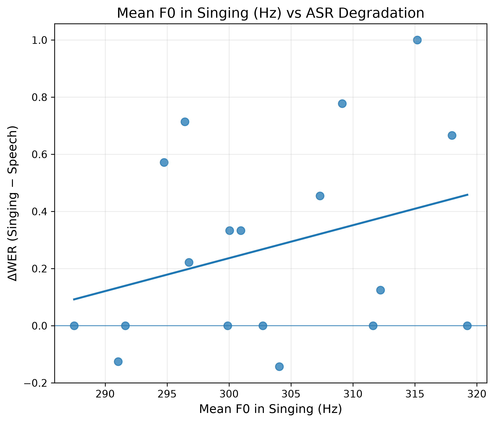
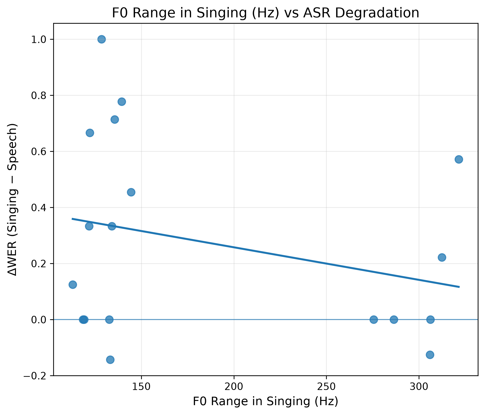
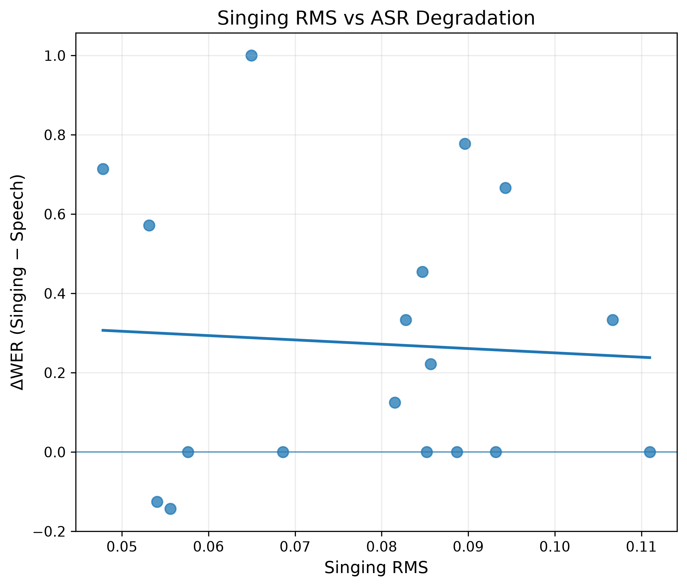

# Singing ASR Benchmark

> A small-scale study of ASR robustness under the speech-to-singing domain shift.

## Overview

Automatic speech recognition (ASR) systems have achieved strong performance on conversational speech, but singing introduces substantially different acoustic characteristics, including sustained vowels, pitch variation, rhythmic changes, and longer phonetic durations.

This project investigates whether a pretrained ASR foundation model remains robust when the same utterances are spoken versus sung.

I use **Whisper** as a fixed pretrained ASR baseline and compare recognition performance on paired speech and singing recordings in **English and French**.

### Research Question

**How robust is a pretrained ASR foundation model to the domain shift from speech to singing?**

### Secondary Questions

1. Does singing degrade ASR performance relative to speech?
2. What types of recognition errors increase under singing?
3. Are singing-related errors associated with language, utterance length, or acoustic characteristics?

---

## Experimental Design

The core idea is a **paired comparison**.

Each sentence is recorded twice:

- **Speech** — natural spoken reading
- **Singing** — the same sentence sung using a simple melody

This controls for linguistic content and allows the analysis to focus on the effect of singing.

### Dataset

| Property | Design |
|---|---|
| Languages | English, French |
| Utterance groups | Short, Medium, Long |
| Utterances per language | 9 |
| Paired utterances | 18 |
| Total recordings | 36 |
| Conditions | Speech, Singing |

The English and French sentences are semantically corresponding translations. Because the two languages have different phonological and syllabic structures, the melodies are adapted naturally rather than enforcing exact note-to-syllable alignment.

### Singing Setup

To reduce unnecessary variation, the singing recordings use a simple melodic structure:

- C major
- Mostly C4–G4
- Approximately 90 BPM
- 4/4 meter
- Limited vibrato and ornamentation
- Natural singing style

---

## Method

### ASR Model

The experiment uses **Whisper**, a pretrained multilingual speech recognition foundation model.

The model is used **without fine-tuning**. This allows the experiment to measure how a fixed pretrained ASR system behaves under a speech-to-singing domain shift.

Inference is performed using [`faster-whisper`](https://github.com/SYSTRAN/faster-whisper).

### Evaluation Metrics

Recognition performance is evaluated using:

**Word Error Rate (WER)**

\[
WER = \frac{S + D + I}{N}
\]

where:

- \(S\) = substitutions
- \(D\) = deletions
- \(I\) = insertions
- \(N\) = number of words in the reference

**Character Error Rate (CER)** is also calculated.

In addition, substitution, deletion, and insertion errors are analyzed separately.

Because the experiment uses paired recordings, speech and singing WER/CER are compared using the **Wilcoxon signed-rank test**.

---

# Results

## 1. Singing substantially degrades ASR performance

Across 18 paired utterances:

| Metric | Speech | Singing | Mean Δ |
|---|---:|---:|---:|
| WER | 0.134 | 0.408 | **+0.274** |
| CER | 0.064 | 0.177 | **+0.112** |

The paired Wilcoxon signed-rank test gives:

| Metric | p-value | Effect size \(r\) |
|---|---:|---:|
| WER | **0.0068** | **0.781** |
| CER | **0.0192** | **0.649** |

These results provide evidence that singing substantially reduces recognition accuracy relative to speech in this dataset.

### Paired WER


Each row represents one paired utterance. The plot highlights the change from speech to singing at the utterance level.

The magnitude of degradation varies considerably across utterances: some remain relatively robust, while others show severe increases in WER.

---

## 2. Singing-related errors are dominated by substitutions

After normalizing error counts by reference word count:

| Error Type | Speech | Singing |
|---|---:|---:|
| Substitution | 0.115 | **0.296** |
| Deletion | 0.005 | 0.057 |
| Insertion | 0.014 | 0.055 |

The largest increase occurs in **substitution errors**.

This suggests that singing does not simply cause the ASR system to miss portions of the signal. Instead, the model frequently maps sung acoustic patterns to incorrect lexical hypotheses.

### Error Type Comparison


---

## 3. The effect varies across languages


In this dataset, French shows higher WER than English in both speech and singing conditions.

This is treated as an exploratory observation rather than a general claim about language difficulty because each language contains only nine paired utterances.

---

## 4. Sentence length does not show a simple monotonic effect


The increase in WER does not follow a simple pattern in which longer utterances always produce greater singing-related degradation.

The medium-length condition shows relatively small degradation compared with the short and long conditions.

Because each length group contains only six paired observations, this analysis is exploratory.

---

## 5. Acoustic exploratory analysis

Acoustic features were extracted from the singing recordings to explore whether utterance-level variation in ASR degradation could be associated with measurable properties of the audio.

The extracted features include:

- Singing duration
- Mean F0
- F0 standard deviation
- F0 range
- RMS energy

The Pearson correlations with singing-related WER degradation (\(\Delta WER\)) were:

| Acoustic Feature | Pearson \(r\) |
|---|---:|
| Singing duration | 0.025 |
| Mean F0 | 0.315 |
| F0 standard deviation | -0.394 |
| F0 range | -0.282 |
| RMS | -0.059 |

Singing duration and RMS showed little apparent association with ASR degradation.

F0-related features showed potentially interesting associations, particularly F0 variability. However, these results are considered **exploratory** because of the small sample size and potential pitch-tracking noise.

### Acoustic Plots









---

# Qualitative Error Analysis

Quantitative metrics show that singing increases ASR error, but individual transcription examples reveal how the model fails.

### Local Lexical Substitution

**Reference**

> The morning feels warm and bright.

**Singing prediction**

> The morning feels woman bright.

Here the model preserves most of the sentence but substitutes a locally similar lexical item:

`warm → woman`

---

### Severe Phrase-Level Distortion

**Reference**

> A quiet melody can make an ordinary evening feel special.

**Singing prediction**

> "Ah, quiet melody can't make it Hold on to the rain evening few special"

The corresponding speech recording is transcribed correctly, while the singing version shows substantial phrase-level distortion.

---

### Singing Does Not Always Cause Failure

**Reference**

> Learning a new language takes time and patience.

Both the speech and singing recordings are transcribed correctly.

This indicates that singing-related degradation is **heterogeneous rather than deterministic**.

---

### Occasional Improvement Under Singing

For `fr_05`, the singing transcription is actually closer to the reference than the speech transcription.

This further suggests that singing increases error risk on average but does not necessarily worsen every individual utterance.

---

# Key Findings

### 1. Singing substantially reduces ASR accuracy

WER increased from **0.134 to 0.408**, while CER increased from **0.064 to 0.177**.

### 2. The degradation is primarily driven by substitutions

Normalized substitution error rate increased from **0.115 to 0.296**, substantially more than deletion or insertion rates.

### 3. Singing-related degradation is heterogeneous

Some utterances remain correctly recognized under singing, while others exhibit severe phrase-level distortion.

### 4. Language and utterance characteristics may contribute

French showed higher WER than English in this dataset, while sentence length did not produce a simple monotonic pattern.

### 5. Acoustic correlates remain exploratory

Duration and RMS showed little apparent relationship with degradation. F0-related measures may warrant further investigation.

---

# Limitations

This is a small-scale exploratory study with several limitations.

### Small Sample Size

The benchmark contains only **18 paired utterances**. The results should therefore be interpreted as findings within this dataset rather than population-level conclusions.

### Single Speaker

All recordings were produced by one speaker, so speaker-specific characteristics may influence the results.

### Limited Linguistic Coverage

Only English and French are included, with a small number of sentences per language.

### Single ASR Model

The current study evaluates Whisper only. It therefore does not determine whether the observed singing-related degradation generalizes to other pretrained ASR architectures.

### Acoustic Feature Reliability

Pitch-based features are estimated automatically and may contain errors, particularly in sung audio.

---

# Future Work

Potential extensions include:

- Evaluate additional pretrained ASR models.
- Expand the benchmark to multiple speakers.
- Add more languages and singing styles.
- Test different melodic contours and pitch ranges.
- Improve F0 extraction and pitch-related analysis.
- Investigate whether ASR adaptation or fine-tuning can reduce singing-related degradation.
- Extend the analysis to singing-specific tasks such as lyric transcription and lyrics-to-audio alignment.

---

# Project Structure

```text
singing-asr-benchmark/
│
├── data/
│   ├── audio/
│   │   ├── en/
│   │   └── fr/
│   └── metadata_ground_truth.csv
│
├── results/
│   ├── figures/
│   │   ├── fig1_paired_wer.png
│   │   ├── fig2_wer_language.png
│   │   ├── fig3_delta_wer_length.png
│   │   ├── fig4_error_types.png
│   │   ├── fig5_duration_vs_delta_wer.png
│   │   ├── fig5_mean_f0_vs_delta_wer.png
│   │   ├── fig5_f0_std_vs_delta_wer.png
│   │   ├── fig5_f0_range_vs_delta_wer.png
│   │   └── fig5_rms_vs_delta_wer.png
│   │
│   ├── transcriptions.csv
│   ├── metrics.csv
│   ├── summary_by_condition.csv
│   ├── acoustic_features.csv
│   ├── final_analysis.csv
│   ├── overall_summary.csv
│   ├── statistical_tests.csv
│   ├── normalized_error_rates.csv
│   └── acoustic_correlations.csv
│
├── run_whisper.py
├── evaluate.py
├── extract_features.py
├── analyze_data.py
├── analyze_results.py
├── README.md
└── .gitignore