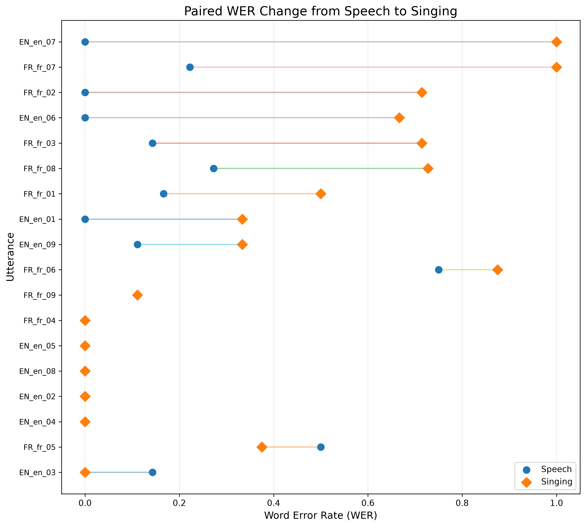
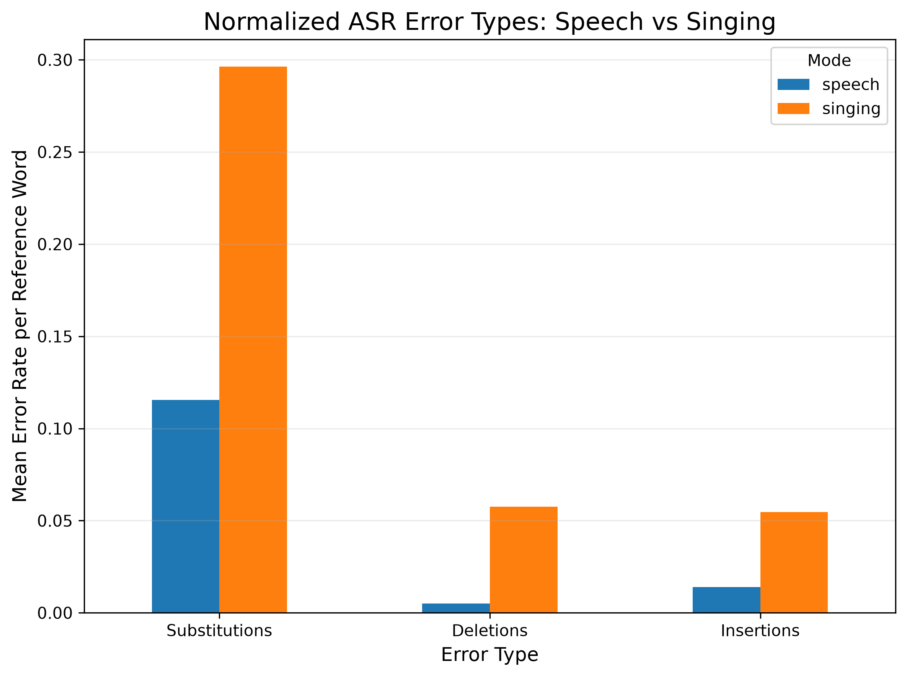
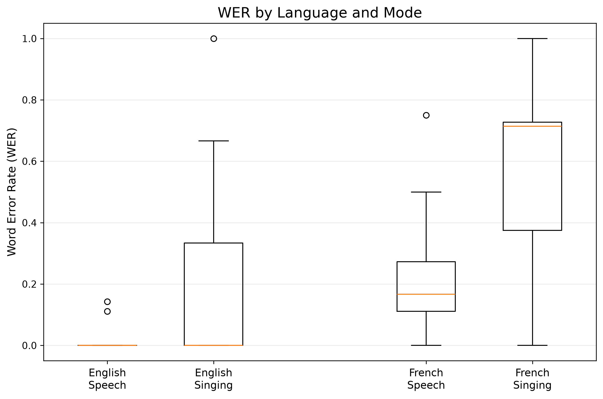
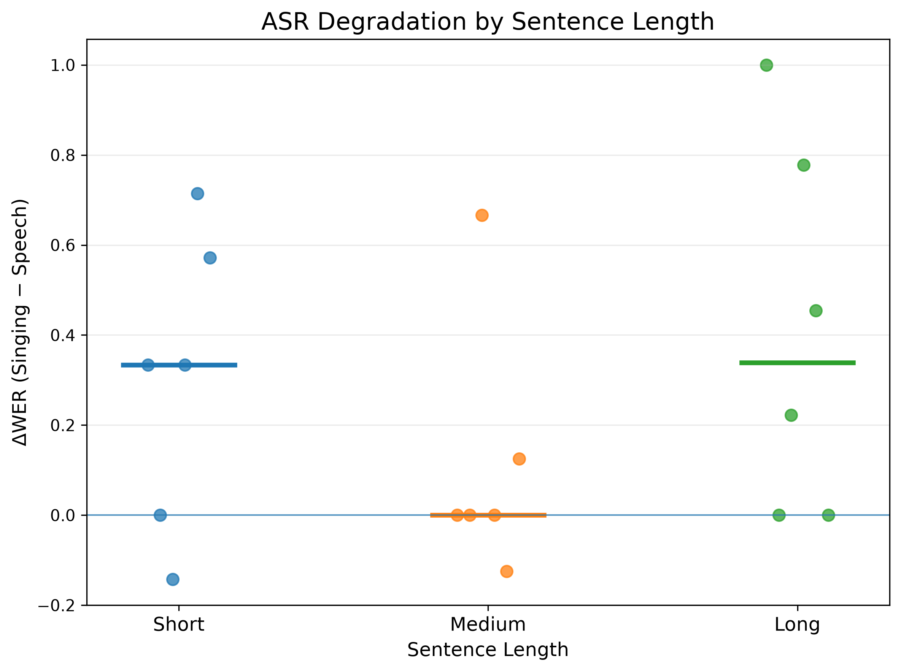
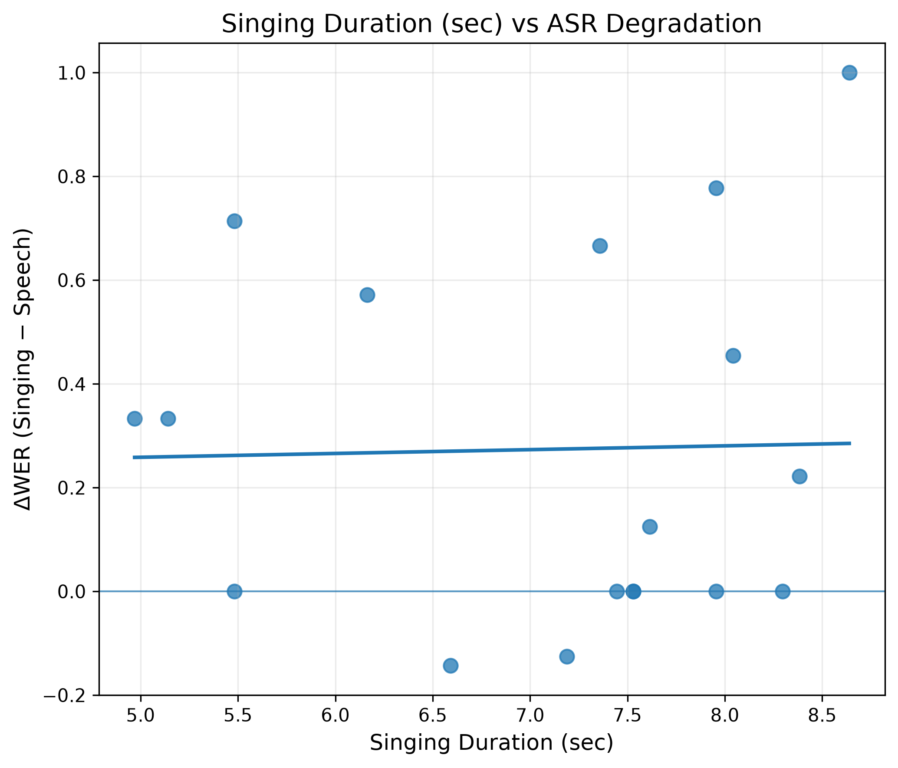
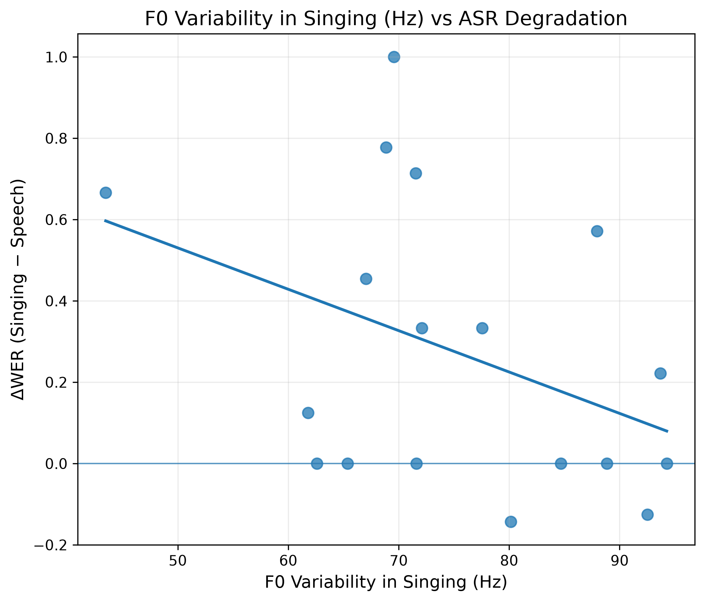

# Singing ASR Benchmark

> A small-scale study of ASR robustness under the speech-to-singing domain shift.

[](https://www.python.org/)
[](https://github.com/openai/whisper)

## Key Result

Across **18 paired utterances**, singing substantially increased ASR error:

- **WER:** 0.134 → **0.408** (mean Δ = +0.274)
- **CER:** 0.064 → **0.177** (mean Δ = +0.112)

Paired Wilcoxon signed-rank tests indicated significant differences:

- **WER:** *p* = 0.0068, effect size *r* = 0.781
- **CER:** *p* = 0.0192, effect size *r* = 0.649

The degradation was primarily driven by **substitution errors**, while the magnitude of degradation varied substantially across utterances.

---

# Overview

Automatic speech recognition (ASR) systems have achieved strong performance on conversational speech, but singing introduces substantially different acoustic characteristics, including sustained vowels, pitch variation, rhythmic changes, intensity variation, and altered phoneme durations.

This project investigates whether a pretrained ASR model remains robust when the same linguistic content is **spoken versus sung**.

I use **Whisper** as a fixed pretrained multilingual ASR baseline and evaluate its performance on paired speech and singing recordings in **English and French**.

The central idea is to treat **speech-to-singing as a domain shift** and examine how recognition accuracy and error patterns change under this shift.

---

# Research Question

## Main Question

**How robust is a pretrained ASR model to the domain shift from speech to singing?**

## Secondary Questions

1. Does singing degrade ASR performance relative to speech?
2. What types of recognition errors increase under singing?
3. Do language, utterance length, or acoustic characteristics help explain variation in singing-related degradation?

---

# Experimental Design

The experiment uses a **paired design**.

Each sentence is recorded twice:

- **Speech** — natural spoken reading
- **Singing** — the same sentence sung using a simple melody

Because the linguistic content is held constant within each pair, differences in ASR performance can be attributed to the change in vocal production more directly than in an unpaired comparison.

## Dataset

| Property | Design |
|---|---|
| Languages | English, French |
| Utterance groups | Short, Medium, Long |
| Utterances per language | 9 |
| Paired utterances | 18 |
| Total recordings | 36 |
| Conditions | Speech, Singing |

The English and French sentences are **semantically corresponding translations**. They are not forced into word-for-word or syllable-for-syllable equivalence because the two languages have different phonological and syllabic structures.

## Singing Setup

To reduce unnecessary variation, the singing recordings use a simple melodic setup:

- C major
- Mostly C4–G4
- Approximately 90 BPM
- 4/4 meter
- Limited vibrato and ornamentation
- Natural singing style

The melody serves as a controlled musical scaffold rather than a strict note-to-syllable alignment.

---

# Method

## ASR Model

The experiment uses **Whisper**, a pretrained multilingual speech recognition model.

The model is used **without fine-tuning** so that the analysis focuses on the robustness of a fixed pretrained ASR system under a speech-to-singing domain shift.

Inference is performed using [`faster-whisper`](https://github.com/SYSTRAN/faster-whisper).

## Evaluation Metrics

### Word Error Rate (WER)

**WER = (S + D + I) / N**

where:

- **S** = substitutions
- **D** = deletions
- **I** = insertions
- **N** = number of words in the reference

WER is used as the **primary evaluation metric** because the main research question concerns word-level ASR robustness.

### Character Error Rate (CER)

CER provides a **complementary character-level measure** of recognition accuracy.

Using both WER and CER helps assess whether the observed speech-to-singing degradation is consistent across different levels of text representation.

### Error Decomposition

Recognition errors are additionally decomposed into:

- substitutions
- deletions
- insertions

Because the experiment uses paired recordings, speech and singing WER/CER are compared using the **Wilcoxon signed-rank test**.

The main effect of the speech-to-singing shift is quantified as:

**ΔWER = WER_singing − WER_speech**

and similarly for CER.

---

# Results

## 1. Singing substantially degrades ASR performance

Across all 18 paired utterances:

| Metric | Speech | Singing | Mean Δ | Median Δ |
|---|---:|---:|---:|---:|
| WER | 0.134 | 0.408 | **+0.274** | +0.174 |
| CER | 0.064 | 0.177 | **+0.112** | +0.097 |

The paired Wilcoxon signed-rank tests show:

| Metric | Wilcoxon statistic | *p*-value | Effect size *r* |
|---|---:|---:|---:|
| WER | 4.5 | **0.0068** | **0.781** |
| CER | 12.0 | **0.0192** | **0.649** |

The same linguistic content therefore produced substantially higher recognition error under singing than under speech in this dataset.

### Paired WER



Each row represents one paired utterance. The figure illustrates the heterogeneous nature of the effect: some utterances show large increases in WER, while others remain relatively robust.

---

## 2. The degradation is primarily driven by substitutions

After normalizing error counts by reference word count:

| Error Type | Speech | Singing | Increase |
|---|---:|---:|---:|
| Substitution | 0.115 | **0.296** | +0.181 |
| Deletion | 0.005 | 0.057 | +0.052 |
| Insertion | 0.014 | 0.055 | +0.041 |

The largest increase is observed in **substitution errors**.

The pattern is consistent with singing causing the ASR system to produce **incorrect lexical hypotheses**, rather than the degradation being explained only by missing segments.

### Normalized Error Types



---

## 3. Language differences are observable but exploratory



In this dataset, French exhibits higher WER than English in both speech and singing conditions.

This may reflect differences in linguistic and phonetic characteristics, model coverage, or the specific utterances used in the benchmark. However, the current dataset contains only nine paired utterances per language, so this result should be treated as **exploratory rather than a general statement about language difficulty**.

---

## 4. Sentence length does not show a simple monotonic effect



The increase in WER does not follow a simple pattern in which longer utterances always produce greater singing-related degradation.

The medium-length condition shows relatively small degradation compared with the short and long conditions.

Because each length group contains only six paired observations, this analysis is exploratory.

---

# Qualitative Error Analysis

The examples below were selected to represent distinct error patterns observed in the paired results rather than as isolated anecdotes.

## English

### 1. Local lexical substitution

**Reference**

> The morning feels warm and bright.

**Speech prediction**

> The morning feels warm and bright.

**Singing prediction**

> The morning feels woman bright.

The singing condition introduces a localized lexical substitution:

`warm → woman`

Most of the utterance remains correct, but a single substitution increases WER.

---

### 2. Severe phrase-level distortion

**Reference**

> A quiet melody can make an ordinary evening feel special.

**Speech prediction**

> A quiet melody can make an ordinary evening feel special.

**Singing prediction**

> "Ah, quiet melody can't make it Hold on to the rain evening few special"

The spoken recording is transcribed correctly, whereas the singing recording shows substantial phrase-level distortion.

The output nevertheless remains composed largely of plausible English words. This illustrates how a singing input can lead to an incorrect but superficially fluent lexical sequence.

---

### 3. Singing does not always cause failure

**Reference**

> Learning a new language takes time and patience.

**Speech prediction**

> Learning a new language takes time and patience.

**Singing prediction**

> Learning a new language takes time and patience.

Both conditions are transcribed correctly.

This is an important counterexample to the overall degradation trend and shows that singing-related errors are **heterogeneous rather than deterministic**.

---

## French

### 1. Local lexical and phonetic distortion

**Reference**

> Le matin est doux et lumineux.

**Speech prediction**

> Le matin est tout et lumineux.

**Singing prediction**

> Le matin est tout élimineux.

The speech condition contains a localized substitution, while the singing condition introduces additional lexical and phonetic distortion.

---

### 2. Severe phrase-level distortion

**Reference**

> Une mélodie calme peut rendre une soirée ordinaire spéciale.

**Speech prediction**

> Une mélodie galme peut rendre une soirée audinaire spéciale.

**Singing prediction**

> Une mèle d'hégalme beurre en haine soirée au dix dix spéciales

The singing condition shows substantial phrase-level distortion, whereas the speech condition contains only localized errors.

This provides a qualitatively similar failure pattern to the severe English example and suggests that substantial singing-related distortions are not limited to English.

---

### 3. Singing can occasionally outperform speech

**Reference**

> Parfois, j'écoute de la musique avant de dormir.

**Speech prediction**

> Parfois, j'ai goutte la musique avant d'autant remir.

**Singing prediction**

> Parfois je goutte de la musique avant de dormir.

In this case, the singing transcription is closer to the reference than the speech transcription.

This reinforces the conclusion that singing increases error **on average**, but does not necessarily worsen every individual utterance.

---

# Acoustic Analysis

Acoustic features were extracted from the singing recordings to explore whether utterance-level variation in ASR degradation could be associated with measurable properties of the audio.

The extracted features include:

- singing duration
- mean fundamental frequency (F0)
- F0 standard deviation
- F0 range
- RMS energy

The Pearson correlations with singing-related WER degradation (\(\Delta WER\)) are:

| Acoustic Feature | Pearson \(r\) |
|---|---:|
| Singing duration | 0.025 |
| Mean F0 | 0.315 |
| F0 standard deviation | -0.394 |
| F0 range | -0.282 |
| RMS | -0.059 |

Singing duration and RMS show little apparent association with ASR degradation in this dataset.

F0 variability shows the strongest exploratory association among the extracted features. However, this relationship should be interpreted cautiously because the sample contains only 18 paired observations and pitch tracking may introduce measurement noise.

These acoustic analyses are therefore treated as **exploratory rather than confirmatory**.

## Representative Acoustic Analyses

### Singing Duration



### F0 Variability



Additional acoustic plots for mean F0, F0 range, and RMS are available in `results/figures/`.

---

# Key Findings

### 1. Singing substantially reduces ASR accuracy

Mean WER increased from **0.134 to 0.408**, while mean CER increased from **0.064 to 0.177**.

### 2. The degradation is primarily driven by substitutions

Normalized substitution error rate increased from **0.115 to 0.296**, substantially more than deletion or insertion rates.

### 3. The effect is heterogeneous

Some sung utterances remain perfectly recognized, while others exhibit severe phrase-level distortion.

### 4. Language differences are observable

French shows higher WER than English in both speech and singing conditions in this dataset, although this comparison remains exploratory.

### 5. Simple acoustic measures do not fully explain the variation

Duration and RMS show little apparent association with degradation, while F0-related features may warrant further investigation.

---

# Limitations

This is a **small-scale exploratory benchmark**, and several limitations should be considered.

## Small Sample Size

The benchmark contains only **18 paired utterances**.

The statistical tests provide evidence of differences within this dataset, but the results should not be interpreted as population-level estimates.

## Single Speaker

All recordings were produced by one speaker.

Speaker-specific factors such as pronunciation, vocal range, timbre, and singing style may influence the observed results.

## Limited Linguistic Coverage

Only English and French are included, with nine paired utterances per language.

The findings may therefore not generalize to other languages or phonological systems.

## Single ASR Model

The current experiment evaluates Whisper only.

It therefore cannot determine whether the observed singing-related degradation is specific to Whisper or reflects a broader limitation shared by other pretrained ASR architectures.

## Speech–Singing Acoustic Differences Are Not Isolated

The paired design controls the **linguistic content**, but changing from speech to singing simultaneously changes multiple acoustic properties, including:

- pitch
- phoneme duration
- rhythm
- intensity
- vowel duration
- temporal alignment

Therefore, the current experiment measures the overall effect of changing from speech production to singing rather than isolating the causal effect of any individual acoustic feature.

## Melody and Singing Style

The singing recordings use a relatively simple melody, moderate pitch range, controlled tempo, and limited ornamentation.

Different melodies, wider pitch ranges, vibrato, ornamentation, vocal techniques, or musical styles may produce different levels of ASR degradation.

## Acoustic Feature Reliability

Pitch-based features are estimated automatically and may contain tracking errors, especially for sung audio.

The acoustic correlations should therefore be interpreted as exploratory observations rather than definitive explanations of model behavior.

---

# Future Work

The current benchmark motivates several extensions.

## Cross-Model Robustness

Evaluate additional pretrained ASR architectures to determine whether singing-related degradation is specific to Whisper or generalizes across different model families.

## Speaker Expansion

Add multiple speakers with different accents, vocal ranges, timbres, and singing styles.

## Acoustic Intervention

Systematically vary individual factors such as:

- pitch range
- note duration
- tempo
- vibrato
- vocal intensity

This would help distinguish which acoustic properties most strongly affect ASR robustness.

## Dataset Expansion

Increase the number of utterances and languages to improve statistical power and generalizability.

## Singing-Aware Adaptation

Investigate whether domain adaptation or singing-aware fine-tuning can reduce the observed degradation.

## Singing-Specific Tasks

Extend the benchmark beyond general ASR to tasks such as:

- lyric transcription
- lyrics-to-audio alignment
- singing voice transcription
- multimodal speech-and-music understanding

---

# Project Structure

```text
singing-asr-benchmark/
│
├── data/
│   ├── audio/
│   │   ├── en/
│   │   └── fr/
│   └── metadata_ground_truth.csv
│
├── results/
│   ├── figures/
│   │   ├── fig1_paired_wer.png
│   │   ├── fig2_wer_language.png
│   │   ├── fig3_delta_wer_length.png
│   │   ├── fig4_error_types.png
│   │   ├── fig5_duration_vs_delta_wer.png
│   │   ├── fig5_mean_f0_vs_delta_wer.png
│   │   ├── fig5_f0_std_vs_delta_wer.png
│   │   ├── fig5_f0_range_vs_delta_wer.png
│   │   └── fig5_rms_vs_delta_wer.png
│   │
│   ├── transcriptions.csv
│   ├── metrics.csv
│   ├── summary_by_condition.csv
│   ├── acoustic_features.csv
│   ├── final_analysis.csv
│   ├── overall_summary.csv
│   ├── statistical_tests.csv
│   ├── normalized_error_rates.csv
│   ├── acoustic_correlations.csv
│   └── analysis_summary.txt
│
├── run_whisper.py
├── evaluate.py
├── extract_features.py
├── analyze_data.py
├── analyze_results.py
├── README.md
├── .gitignore
└── requirements.txt